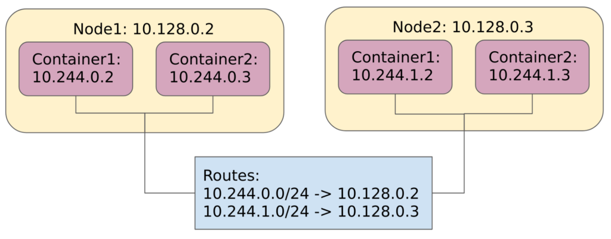

# CNI Networking

## Module Objectives

1. Create a K8s master and worker node on GCE with `kubeadm`
1. Create a bash CNI
1. Deploy Pods and test connectivity
1. Configure host, container and external networking

---

## Create a Kubernetes Master and Worker Node on GCE with `kubeadm`

1. Kubernetes network model:

    

1. Create a master VM.

    ```shell
    gcloud compute instances create k8s-master \
        --zone us-west2-b \
        --image-family ubuntu-1604-lts \
        --image-project ubuntu-os-cloud \
        --can-ip-forward
    ```

1. Create a worker VM.

    ```shell
    gcloud compute instances create k8s-worker \
        --zone us-west2-b \
        --image-family ubuntu-1604-lts \
        --image-project ubuntu-os-cloud \
        --can-ip-forward
    ```

1. Open two cloud-shell terminals, SSH into `k8s-master` in one, and `k8s-worker` on the other.

    ```shell
    gcloud compute ssh "k8s-master" --zone us-west2-b
    ```

    ```shell
    gcloud compute ssh "k8s-worker" --zone us-west2-b
    ```

1. On both master and worker nodes install prerequisite packages.

    ```shell
    sudo apt-get update
    sudo apt-get install -y docker.io apt-transport-https curl jq nmap iproute2
    ```

1. On both master and worker nodes install `kubeadm`, `kubelet`, and `kubectl`.

    ```
    sudo su
    curl -s https://packages.cloud.google.com/apt/doc/apt-key.gpg | apt-key add -
    cat > /etc/apt/sources.list.d/kubernetes.list <<EOF
    deb http://apt.kubernetes.io/ kubernetes-xenial main
    EOF
    apt-get update && apt-get install -y kubeadm kubelet kubectl
    ```

1. On the master node start the cluster.

    ```shell
    sudo kubeadm init --pod-network-cidr=10.244.0.0/16 --ignore-preflight-errors=NumCPU
    ```

    **Record the command provided in the output. It will used to join additional nodes to the cluster**

    The command to join the cluster should look something like this:

    ```
    kubeadm join 10.168.0.6:6443 --token abcdef.1234567890123456789 --discovery-token-ca-cert-hash sha256:12345
    ```

1. On the worker node, join the worker to the cluster. Run the command from the previous master terminal output.

1. On the master node, initialize `kubectl`.

    ```shell
    exit # Assuming still root, this must be run as a regular user
    mkdir -p $HOME/.kube
    sudo cp -i /etc/kubernetes/admin.conf $HOME/.kube/config
    sudo chown $(id -u):$(id -g) $HOME/.kube/config
    ```

## Create a bash CNI

1. On the master node, get Pod subnets.

    ```shell
    kubectl describe node k8s-master | grep PodCIDR
    ```

    ```
    PodCIDR: 10.244.0.0/24
    ```

    ```shell
    kubectl describe node k8s-worker | grep PodCIDR
    ```

    ```
    PodCIDR: 10.244.1.0/24
    ```

1. On both master and worker nodes, create `/etc/cni/net.d/10-bash-cni-plugin.conf`.

    ```shell
    sudo mkdir -p /etc/cni/net.d/
    sudo touch /etc/cni/net.d/10-bash-cni-plugin.conf
    ```

    Master:

    ```json
    {
      "cniVersion": "0.3.1",
      "name": "mynet",
      "type": "bash-cni",
      "network": "10.244.0.0/16",
      "subnet": "10.244.0.0/24"
    }
    ```

    Worker:

    ```json
    {
      "cniVersion": "0.3.1",
      "name": "mynet",
      "type": "bash-cni",
      "network": "10.244.0.0/16",
      "subnet": "10.244.1.0/24"
    }
    ```

1. On both master and worker nodes, create the bridge.

    Master:

    ```shell
    sudo brctl addbr cni0
    sudo ip link set cni0 up
    sudo ip addr add 10.244.0.1/24 dev cni0
    ```

    Worker:

    ```shell
    sudo brctl addbr cni0
    sudo ip link set cni0 up
    sudo ip addr add 10.244.1.1/24 dev cni0
    ```

1. On both master and worker nodes, check generated routes.

    Master:

    ```shell
    ip route | grep cni0
    ```
    ```
    10.244.0.0/24 dev cni0  proto kernel  scope link  src 10.244.0.1
    ```

    Worker:

    ```shell
    ip route | grep cni0
    ```
    ```
    10.244.1.0/24 dev cni0  proto kernel  scope link  src 10.244.1.1
    ```

1. On both master and worker nodes, create `/opt/cni/bin/bash-cni` as root and give it executable permissions `sudo chmod +x`.

    ```shell
    sudo touch /opt/cni/bin/bash-cni
    sudo chmod +x /opt/cni/bin/bash-cni
    ```

    ```shell
    #!/bin/bash -e

    if [[ ${DEBUG} -gt 0 ]]; then set -x; fi

    exec 3>&1 # make stdout available as fd 3 for the result
    exec &>> /var/log/bash-cni-plugin.log

    IP_STORE=/tmp/reserved_ips # all reserved ips will be stored there

    echo "CNI command: $CNI_COMMAND"

    stdin=`cat /dev/stdin`
    echo "stdin: $stdin"

    allocate_ip(){
      for ip in "${all_ips[@]}"
      do
        reserved=false
        for reserved_ip in "${reserved_ips[@]}"
        do
          if [ "$ip" = "$reserved_ip" ]; then
            reserved=true
            break
          fi
        done

        if [ "$reserved" = false ] ; then
          echo "$ip" >> $IP_STORE
          echo "$ip"
          return
        fi
      done
    }

    case $CNI_COMMAND in
    ADD)
      network=$(echo "$stdin" | jq -r ".network")
      subnet=$(echo "$stdin" | jq -r ".subnet")
      subnet_mask_size=$(echo $subnet | awk -F  "/" '{print $2}')

      all_ips=$(nmap -sL $subnet | grep "Nmap scan report" | awk '{print $NF}')
      all_ips=(${all_ips[@]})
      skip_ip=${all_ips[0]}
      gw_ip=${all_ips[1]}
      reserved_ips=$(cat $IP_STORE 2> /dev/null || printf "$skip_ip\n$gw_ip\n") # reserving 10.244.0.0 and 10.244.0.1
      reserved_ips=(${reserved_ips[@]})
      printf '%s\n' "${reserved_ips[@]}" > $IP_STORE
      container_ip=$(allocate_ip)

      mkdir -p /var/run/netns/
      ln -sfT $CNI_NETNS /var/run/netns/$CNI_CONTAINERID

      rand=$(tr -dc 'A-F0-9' < /dev/urandom | head -c4)
      host_if_name="veth$rand"
      ip link add $CNI_IFNAME type veth peer name $host_if_name

      ip link set $host_if_name up
      ip link set $host_if_name master cni0

      ip link set $CNI_IFNAME netns $CNI_CONTAINERID
      ip netns exec $CNI_CONTAINERID ip link set $CNI_IFNAME up
      ip netns exec $CNI_CONTAINERID ip addr add $container_ip/$subnet_mask_size dev $CNI_IFNAME
      ip netns exec $CNI_CONTAINERID ip route add default via $gw_ip dev $CNI_IFNAME

      mac=$(ip netns exec $CNI_CONTAINERID ip link show eth0 | awk '/ether/ {print $2}')
    echo "{
      \"cniVersion\": \"0.3.1\",
      \"interfaces\": [
          {
              \"name\": \"eth0\",
              \"mac\": \"$mac\",
              \"sandbox\": \"$CNI_NETNS\"
          }
      ],
      \"ips\": [
          {
              \"version\": \"4\",
              \"address\": \"$container_ip/$subnet_mask_size\",
              \"gateway\": \"$gw_ip\",
              \"interface\": 0
          }
      ]
    }" >&3

    ;;

    DEL)
      ip=$(ip netns exec $CNI_CONTAINERID ip addr show eth0 | awk '/inet / {print $2}' | sed  s%/.*%% || echo "")
      if [ ! -z "$ip" ]
      then
        sed -i "/$ip/d" $IP_STORE
      fi
    ;;

    GET)
      echo "GET not supported"
      exit 1
    ;;

    VERSION)
    echo '{
      "cniVersion": "0.3.1",
      "supportedVersions": [ "0.3.0", "0.3.1", "0.4.0" ]
    }' >&3
    ;;

    *)
      echo "Unknown cni commandn: $CNI_COMMAND"
      exit 1
    ;;

    esac
    ```

1. On the master node, check the node status.

    ```shell
    kubectl get node
    ```

1. Untaint the master node (to allow the scheduler to schedule pods everywhere).

    ```shell
    kubectl taint nodes k8s-master node-role.kubernetes.io/master-
    ```

## Deploy Pods and Test Connectivity

**The following will be performed on the Master nodes (where `kubectl` is configured)**

1. Add a sample Deployment.

    ```shell
    kubectl apply -f https://raw.githubusercontent.com/s-matyukevich/bash-cni-plugin/master/01_gcp/test-deployment.yml
    ```

1. Get the Pod IPs.

    ```shell
    kubectl describe pod | grep IP
    ```

    ```
    IP:                 10.244.0.4
    IP:                 10.244.1.3
    IP:                 10.244.0.6
    IP:                 10.244.1.2
    ```

1. Exec into one of the Pods.

    ```shell
    kubectl exec -it bash-master bash
    ```

1. Verify network connectivity. (Your ip's maybe slightly different, `ifconfig` should help)

    ```shell
    ping 10.168.0.6 # Can ping own host (e.g. k8s-master)
    ping 10.168.0.7 # Can’t ping different host (e.g. k8s-worker)
    ping 10.244.0.5 # Can ping own container
    ping 10.244.0.6 # Can’t ping a different container on the same host
    ping 10.244.1.3 # Can’t ping a container on a different host
    ping 108.177.121.113 # Can’t ping any external address
    ```

## Configure Host, Container and External Networking

1. On the Worker node, examine forwarding rules.

    ```shell
    sudo iptables -S FORWARD
      -P FORWARD DROP
      -A FORWARD -m comment --comment "kubernetes forwarding rules" -j KUBE-FORWARD
      -A FORWARD -j DOCKER-ISOLATION
      -A FORWARD -o docker0 -j DOCKER
      -A FORWARD -o docker0 -m conntrack --ctstate RELATED,ESTABLISHED -j ACCEPT
      -A FORWARD -i docker0 ! -o docker0 -j ACCEPT
      -A FORWARD -i docker0 -o docker0 -j ACCEPT
    ```

1. On both master and worker nodes, allow forwarding.

    ```shell
    sudo iptables -t filter -A FORWARD -s 10.244.0.0/16 -j ACCEPT
    sudo iptables -t filter -A FORWARD -d 10.244.0.0/16 -j ACCEPT
    ```

1. On both master and worker nodes, add masquerade rules.

    Master:

    ```shell
    sudo iptables -t nat -A POSTROUTING -s 10.244.0.0/24 ! -o cni0 -j MASQUERADE
    ```

    Worker:

    ```shell
    sudo iptables -t nat -A POSTROUTING -s 10.244.1.0/24 ! -o cni0 -j MASQUERADE
    ```

1. On a regular cloud-shell window, configure GCP routes.

    ```shell
    gcloud compute routes create k8s-master --destination-range 10.244.0.0/24 --network default --next-hop-instance-zone us-west2-b --next-hop-instance k8s-master
    gcloud compute routes create k8s-worker --destination-range 10.244.1.0/24 --network default --next-hop-instance-zone us-west2-b --next-hop-instance k8s-worker
    ```

1. Retest network connectivity, all pings should be successful (see previous exercise).

1. Resulting solution:

    

Check our blog post [Kubernetes Networking: How to Write Your Own CNI Plug-in with Bash](https://www.altoros.com/blog/kubernetes-networking-writing-your-own-simple-cni-plug-in-with-bash/) for more details.

## Clean Up

1. Delete GCP routes.

    ```shell
    gcloud compute routes delete k8s-master k8s-worker --quiet
    ```

1. Delete the k8s VMs.

    ```shell
    gcloud compute instances delete k8s-master k8s-worker  --quiet
    ```
